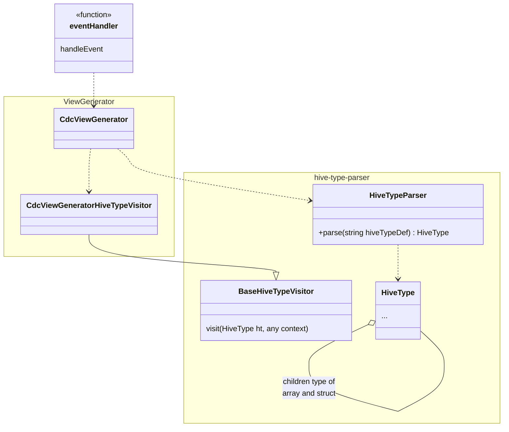

# Logical Entities

## Notification

### Properties Sets

#### Unique identifiers related fields
Notification has two different unique keys a sender related one composed by fields
- senderPaId
- paProtocolNumber
- idempotenceToken

and a native one composed by field
- iun

<details>
  <summary>Schema Fragment</summary>

```yaml
  IUN:
    description: Identificativo Univoco Notifica
    type: string
    minLength: 25
    maxLength: 25
    pattern: ^[A-Z]{4}-[A-Z]{4}-[A-Z]{4}-[0-9]{6}-[A-Z]{1}-[0-9]{1}$
  
  IdsPropertySet:
    type: properties-set
    required:
      - senderPaId
      - paProtocolNumber
      - iun
    properties:
      senderPaId:
        type: string
        description: Identificativo (non IPA) della PA mittente che ha eseguito l'onboarding su SelfCare.
        # wide range of characters
        pattern: ^.*$
        maxLength: 256
      idempotenceToken:
        description: >-
          Identificativo utilizzabile dal chiamante per disambiguare differenti 
          "richieste di notificazione" effettuate con lo stesso numero di protocollo 
          (campo _paProtocolNumber_). Questo può essere necessario in caso di 
          "richiesta di notifica" rifiutata per errori nei codici di verifica degli
          allegati.
        type: string
        # ASCII printable characters
        pattern: ^[ -~]*$
        maxLength: 256
      paProtocolNumber:
        description: >-
          Numero di protocollo che la PA mittente assegna alla notifica stessa
        type: string
        # wide range of characters
        pattern: ^.*$
        maxLength: 256
      iun:
        $ref: '#/components/schemas/IUN'
  ```
</details>


#### Synthetic information
Some fields give an hint on topic related to a notification
- taxonomyCode
- subject
- abstract
- sentAt
- version

<details>
  <summary>Schema Fragment</summary>

  ```yaml
  SyntheticPropertySet:
    type: properties-set
    required:
      - taxonomyCode
      - subject
      - sentAt
    properties:
      taxonomyCode:
        type: string
        minLength: 7
        maxLength: 7
        pattern: "^([0-9]{6}[A-Z]{1})$"
        description: >-
          Codice tassonomico della notifica basato sulla definizione presente nell'allegato 2 capitolo C del bando [__AVVISO PUBBLICO MISURA 1.4.5 PIATTAFORMA NOTIFICHE DIGITALI__](https://pnrrcomuni.fondazioneifel.it/bandi_public/Bando/325)
      subject:
        type: string
        description: titolo della notifica
        maxLength: 134
        # wide range of characters
        pattern: ^.*$
      abstract:
        type: string
        description: descrizione sintetica della notifica
        # wide range of characters
        pattern: ^.*$
        maxLength: 1024
      sentAt:
        type: string
        description: Momento di ricezione della notifica da parte di PN
        format: date-time
      version:                                                    # NO EXTERNAL
        type: string                                              # NO EXTERNAL
        description: Indica la versione della notifica            # NO EXTERNAL
  ```
</details>


#### Documents, Attachment and Recipients
- documents
- recipients

#### Payment information
- amount:
- paFee:
- vat:
- paymentExpirationDate:
- notificationFeePolicy:
- pagoPaIntMode:

<details>
  <summary>Schema Fragment</summary>

  ```yaml
  PaTaxId:
    description: Payment PA fiscal code
    example: '77777777777'
    type: string
    maxLength: 11
    minLength: 11
    pattern: '^\d+$'

  PaFee:
    type: integer
    description: >-
      Costo espresso in eurocent sostenuto dal mittente, per l'elaborazione degli
      atti, provvedimenti, avvisi e comunicazioni oggetto di notifica, per
      il relativo deposito sulla piattaforma e per la gestione degli  esiti
      della notifica (Decreto 30 maggio 2022 - Art. 3, comma 1, lettera a). <br/>
      Obbligatoria per notifiche con notificationFeePolicy=DELIVERY_MODE <br/>
      Per le notifiche effettuate con versioni precedenti alla 2.3 si assume il valore di default 100.<br/>
      Esempio paFee ad 1€ -> 100 <br/>
    format: int32
    minimum: 0
    maximum: 100

  Vat:
    type: integer
    description: >-
      IVA espressa in percentuale sui costi degli avvisi in formato cartaceo.<br/>
      Obbligatoria per notifiche con notificationFeePolicy=DELIVERY_MODE. <br/>
      Per le notifiche effettuate con versioni precedenti alla 2.3 si assume il valore di default 22. <br/>
      Esempio vat al 22% -> 22 <br/>
    format: int32
    minimum: 0
    maximum: 100

  NotificationFeePolicy:
    type: string
    description: >-
      Politica di addebitamento dei costi di notifica. <br/>
      - _FLAT_RATE_: costo forfettario fisso. In questa modalità SEND non gestisce 
      il costo della notifica per il destinatario.<br/>
      - _DELIVERY_MODE_: costo calcolato in base all'effettivo percorso di notifica. <br/>
    enum:
      - FLAT_RATE
      - DELIVERY_MODE

  PaymentPropertySet:
    type: properties-set
    required:
      - taxonomyCode
      - subject
    properties:
      amount:
        type: integer
        format: int32
        description: Importo della notifica in eurocent
      paFee:
        $ref: '#./PaFeeV23'
      vat:
        $ref: '#./VatV23'
      paymentExpirationDate:
        type: string
        minLength: 10
        maxLength: 10
        pattern: "^([0-9]{4})-(1[0-2]|0[1-9])-(3[01]|[12][0-9]|0[1-9])$"
        description: Data di scadenza del pagamento nel formato YYYY-MM-DD riferito all'Italia
        # gestito come stringa e pattern perché con format: date open-api-generator non lo gestiva correttamente
      notificationFeePolicy:
          $ref: "#./NotificationFeePolicy"
      pagoPaIntMode:
        type: string
        description: >-
          Modalitá di integrazione pagoPA per l'attualizazione del costo della notifica. <br/>
          - _NONE_: nessuna attualizzazione. <br/>
          - _SYNC_: modalitá sincrona. <br/>
          - _ASYNC_: modalitá asincrona. <br/>
        enum:
          - NONE
          - SYNC
          - ASYNC
  ```
</details>

#### Other Information
- senderDenomination
- senderTaxId
- physicalCommunicationType
- group
- additionalLanguages
- cancelledIun
- cancelledByIun
- documentsAvailable

<details>
  <summary>Schema Fragment</summary>
  
  ```yaml
  Denomination:
    description: >-
      La denomination prevede max 44 caratteri, codifica isolatin 1, senza | e senza i caratteri 
      di controllo (<!-- __sts__codeValue:DenominationValidationUtils::denominationValidationExcludedCharacter-->).
    type: string
    x-field-extra-annotation: "@lombok.ToString.Exclude" # NO EXTERNAL
    minLength: 1
    maxLength: 44
    pattern: ^.*$
  
  PaTaxId:
    description: Payment PA fiscal code
    example: '77777777777'
    type: string
    maxLength: 11
    minLength: 11
    pattern: '^\d+$'
  
  OtherInfoPropertySet:
    type: propterties-set
    required:
      - taxonomyCode
      - subject
    properties:
      senderDenomination:
        $ref: '#./Denomination'
      senderTaxId:
        $ref: '#./PaTaxId'
      physicalCommunicationType:
        type: string
        description: Tipologia comunicazione fisica
        enum:
          - AR_REGISTERED_LETTER
          - REGISTERED_LETTER_890
      group:
        type: string
        description: Gruppo di utenti dell'ente mittente che può visualizzare la notifica
        # ASCII printable characters
        pattern: ^[ -~]*$
        maxLength: 1024
      additionalLanguages:
        description: >-
          In questo campo è possibile definire la lingua addizionale (oltre a quella italiana) da utilizzare per la generazione documenti, atti opponibili a terzi ecc.<br/>
          Le lingue accettate e dunque i valori possibili degli item dell'array sono: <br/>
          - DE <br/>
          - SI <br/>
          - FR <br/>
          DE (tedesco), SI (sloveno), FR (francese)
          Attualmente è possibile indicare un solo item e dunque una sola lingua aggiuntiva. Se non vengono indicate lingue aggiuntive la lingua utilizzata per generare <br/>
          documenti, atti opponibili a terzi ecc. sarà quella italiana.
        type: array
        items:
          type: string
          maxItems: 1
      cancelledIun:
        $ref: '#/components/schemas/IUN'
      cancelledByIun:
        $ref: '#/components/schemas/IUN'
      documentsAvailable:
        type: boolean
        description: Indica se i documenti notificati sono ancora disponibili.
  ```

</details>


# Un class diagram
 



